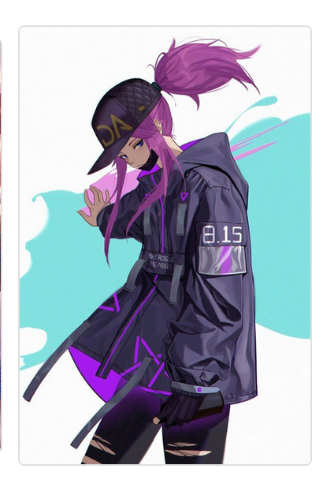

# KDA Akali Clicky Game
clicky game built in React
user must click a single image only once or else score resets.
Images get shuffled after each click for added difficulty

## Application specifications
- must be in react.js
- must keep current score and high score
- must shuffle pictures after each click 

# Screenshots

- on hover card changes color

# installation instructions
`cd` in `my-app`
`npm start`

or go to Github live page
- [Live Link to app](https://ernesturzua.github.io/kda-akali-click-game/)

